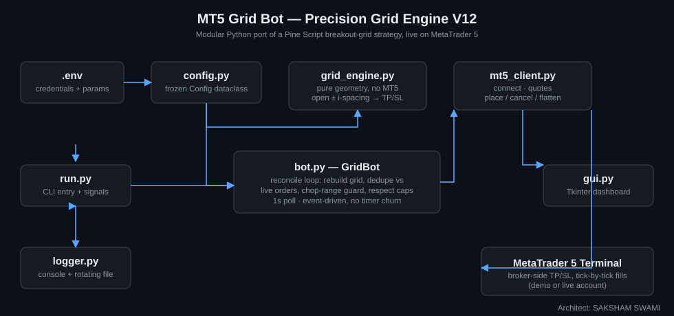
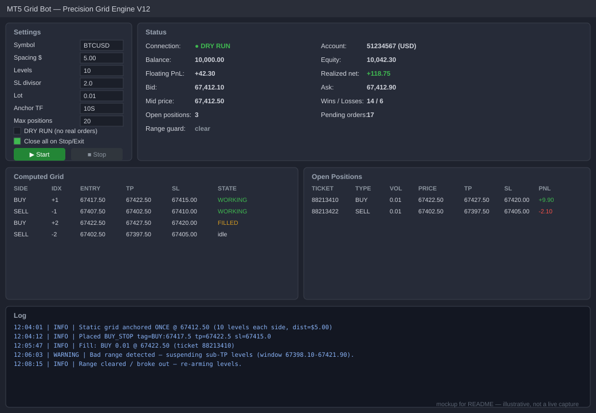

# MT5 Grid Bot — Precision Grid Engine (Master V12)

**Architect: SAKSHAM SWAMI**

A modular Python trading bot that ports the Pine Script strategy
*"Precision Grid Engine [Master V12]"* to a live/demo **MetaTrader 5** account,
trading **BTCUSD** with a bidirectional breakout grid.



## What it does

Every anchor window the bot lays a ladder of stop orders above and below the
current price. Each level can fire in **either direction**:

- price crosses **up** through a level → a `BUY_STOP` fires there
- price crosses **down** through a level → a `SELL_STOP` fires there

Every fill carries a broker-side take-profit (`spacing`) and a tighter
stop-loss (`spacing / SL_DIVISOR`, default 2:1 reward:risk) — no bar-close
assumptions, no manual monitoring. A **chop-range guard** watches recent price
action and suspends only the levels that are stuck in a losing (sub-TP) range,
re-arming them the moment price breaks out again.

## Dashboard



A Tkinter dashboard (`gui.py`) shows live account/equity, the current bid/ask,
the computed grid with each level's state (idle / working / filled), open
positions, and a running win/loss + realized-PnL count — with Start / Stop /
Flatten controls and every core parameter editable from the window. *(The
image above is an illustrative mockup of the layout, not a live capture — the
real dashboard needs a running MT5 terminal and an authenticated broker
session.)*

## Why it's structured this way

| File | Responsibility |
|------|----------------|
| [`config.py`](config.py) | Loads & validates `.env` into a frozen, typed `Config`. |
| [`grid_engine.py`](grid_engine.py) | **Pure** grid geometry, zero MT5 dependency — fully unit-testable. Anchor → up/down levels + TP/SL. |
| [`mt5_client.py`](mt5_client.py) | All MT5 I/O: connect/reconnect, market data, place/cancel/flatten orders. |
| [`bot.py`](bot.py) | The strategy loop: rebuild the grid, reconcile against live broker state, dedupe by side+price (not comment — brokers rewrite those), run the chop guard, respect position/pending caps. |
| [`run.py`](run.py) | Headless CLI entry point with clean-shutdown signal handling. |
| [`gui.py`](gui.py) | Optional Tkinter dashboard wrapping the same bot/client classes. |
| [`logger.py`](logger.py) | Console + rotating file logs under `./logs`. |
| [`test_grid_engine.py`](test_grid_engine.py) | Unit tests for the geometry, runnable without MT5 or a broker. |

Keeping `grid_engine.py` pure (no MT5 calls, no I/O) is the key design
decision: the entire strategy geometry is testable in isolation, and the
broker-facing code (`mt5_client.py`) can be swapped or mocked without touching
the math.

## Live-trading notes vs. the original Pine backtest

- **Sub-minute anchors:** MT5 doesn't expose 1S/10S rates, so `10S`/`30S`
  anchor off the latest tick quantised to the window — the closest live
  equivalent of TradingView's 1-second replay. Use `1M`+ for exact
  candle-open anchoring.
- **TP/SL fills:** the Pine "SL immediate / TP must survive the entry candle"
  rule was a bar-fill assumption for backtesting. Live, TP and SL are attached
  to the order and resolved tick-by-tick by the broker — no assumption
  needed.
- The bot never duplicates a level that already has a working order or open
  position, and cancels stale pendings on every re-anchor.

## Setup

1. Install the MetaTrader 5 terminal and log into your account at least once.
2. Install dependencies:
   ```bash
   py -3.11 -m pip install -r requirements.txt
   ```
3. Copy the config template and fill in your credentials:
   ```bash
   copy .env.example .env
   ```
   Set `MT5_LOGIN`, `MT5_PASSWORD`, `MT5_SERVER`, and confirm `SYMBOL` matches
   your broker's exact name (e.g. `BTCUSD`, `BTCUSDm`, `BTCUSD.r`).

## Run

```bash
run.bat              REM or:  py -3.11 run.py
```

or launch the dashboard:

```bash
gui.bat               REM or:  py -3.11 gui.py
```

**`DRY_RUN=true` is the default** — the bot logs every order it *would*
place but sends nothing to the broker. Verify the behaviour, then set
`DRY_RUN=false` to go live.

## Key parameters (in `.env`)

- `GRID_SPACING_USD` — grid step *and* take-profit distance.
- `GRID_LEVELS` — rungs above and below the anchor (×2 total).
- `SL_DIVISOR` — stop distance = spacing ÷ divisor (default `2.0`).
- `ANCHOR_TIMEFRAME` — `10S`/`30S` re-anchor off live ticks; `1M`+ off candle opens.
- `LOT_SIZE`, `MAX_OPEN_POSITIONS` — sizing and safety cap.
- `RANGE_DETECT`, `RANGE_WINDOW_SEC`, `RANGE_BAND_MULT` — the chop-range guard.
- `MAGIC` — tags this bot's orders so it never touches others on the account.

## Test

```bash
py -3.11 test_grid_engine.py
```

## Disclaimer

This is a trading tool for educational and research purposes. Trading
leveraged instruments like BTCUSD CFDs carries substantial risk of loss.
Nothing here is financial advice — run in `DRY_RUN` mode and on a demo
account before risking real capital.
